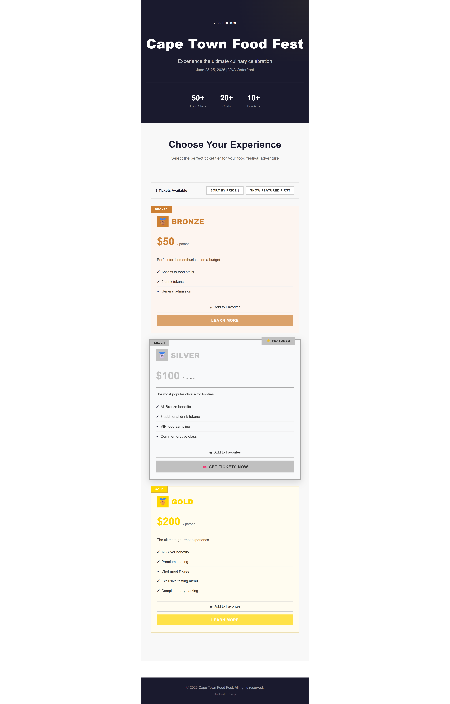

# Food Fest Ticket Landing Page

A modern Vue.js landing page for the Cape Town Food Fest 2026 event. The application displays three ticket tiers (Bronze, Silver, and Gold) with pricing, benefits, and interactive features including favorites, sorting, and color-coded tier differentiation.

## Project Overview

The Cape Town Food Fest is an annual outdoor food festival that brings together chefs, street vendors, and musicians. This landing page showcases ticket tiers with distinct Bronze, Silver, and Gold color schemes, allowing users to explore pricing and benefits before purchasing.

The Silver tier is featured with special styling and a badge. Users can favorite ticket tiers, sort by price or featured status, and interact with a responsive interface built using Vue 3 and Vuex.

## Features

- Three ticket tiers with color differentiation
  - Bronze (#cd7f32)
  - Silver (#c0c0c0)
  - Gold (#ffd700)

- Featured Silver tier with badge styling
- Favorite/unfavorite ticket functionality
- Sort tickets by price (ascending or descending)
- Show featured tickets first
- Responsive design for desktop, tablet, and mobile
- Event header with branding and statistics
- Reusable component architecture

## Screenshot



## Installation

Clone the repository:

```
git clone https://github.com/yourusername/food-fest-ticket-landing-page.git
```

Navigate to the project directory:

```
cd food-fest-ticket-landing-page
```

Install dependencies:

```
npm install
```

Run the development server:

```
npm run dev
```

Open your browser and visit:

```
http://localhost:5173
```

## Build for Production

```
npm run build
```

The production files will be generated in the `dist` folder.

## Tech Stack

- Vue 3
- Vuex
- Vue Router
- Vite
- Vanilla CSS

## Project Structure

```
src/
├── components/
│   ├── TicketCard.vue
│   └── TicketList.vue
├── data/
│   └── tickets.js
├── stores/
│   └── index.js
├── router/
│   └── index.js
├── assets/
│   ├── main.css
│   └── images/
│       └── screenshot.png
├── App.vue
└── main.js
```

## Usage

- Browse the available ticket tiers
- Compare prices and benefits
- Add tickets to your favorites using the star icon
- Remove tickets from favorites by clicking the star again
- Sort tickets by price or featured status
- View the featured Silver ticket tier

## Author

Created as a Vue 3, Vuex, and Vue Router practice project.
